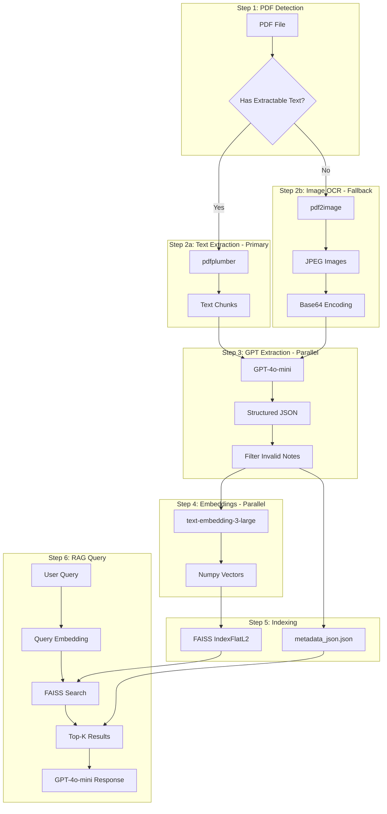

# Salesforce Release Notes RAG Pipeline

## Architecture Overview



## Implementation Details

### Cell 0: Setup and Dependencies

**File:** [RAG using SF Release Documents with OpenAI.ipynb](RAG using SF Release Documents with OpenAI.ipynb)

- Install packages: `pdfplumber`, `pypdf`, `openai`, `faiss-cpu`, `numpy`, `python-dotenv`, `pdf2image`, `pillow`
- Import all required libraries including `ThreadPoolExecutor` for parallel processing
- Load OpenAI API key from `.env` file
- Initialize OpenAI client

### Cell 1: PDF Text Detection

- Create `check_pdf_has_text(pdf_path)` function using `pdfplumber`
- Check first 5 pages for meaningful text (> 100 characters)
- Returns boolean indicating if text extraction is viable
- Determines processing path (text vs image)

### Cell 2: Text Extraction with Structure

**Primary Path (Text Extraction):**

- Create `extract_structured_text(pdf_path)` function
- Extract text with layout preservation using `pdfplumber`
- Split into paragraphs and filter headers/footers
- Create chunks of 500-2000 characters
- Returns list of structured chunks with page numbers

**Fallback Path (Image OCR):**

- `encode_image_to_base64(image_path)` - encodes images for GPT vision
- `extract_release_notes(image_path, client)` - processes images with GPT-4o-mini

### Cell 3: GPT-4o-mini Structured Extraction (Parallel)

**Extraction Function:**

- `extract_release_notes_from_text(chunk, client)` for text-based extraction
- Uses comprehensive system prompt to extract structured data
- Explicitly filters out index pages, table of contents, and navigation content

**Comprehensive JSON Schema:**

```python
{
    "page_number": int,
    "release_notes": [
        {
            "feature_name": str,
            "category": str,           # Sales Cloud, Service Cloud, Platform, etc.
            "product_area": str,       # Flow Builder, LWC, Apex, REST API, etc.
            "change_type": str,        # New Feature, Enhancement, Breaking Change, etc.
            "description": str,
            "availability": str,
            "feature_status": str,     # Beta, Pilot, GA, Preview, Release Update
            "activation_required": str, # Auto-enabled, Manual, Opt-in, etc.
            "edition": str,
            "api_version": str,
            "timeline": str,
            "affected_components": [str],
            "breaking_changes": str,
            "security_notes": str
        }
    ]
}
```

**Parallel Processing:**

- Uses `ThreadPoolExecutor` with 10 workers
- Processes all text chunks concurrently
- Progress logging every 50 chunks

**Post-Processing