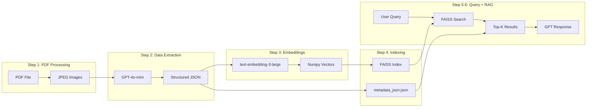

# Salesforce Release Notes RAG Pipeline

## Architecture Overview



## Implementation Plan

### Cell 1: Setup and Dependencies

- Install required packages: `pdf2image`, `pillow`, `openai`, `faiss-cpu`, `numpy`, `python-dotenv`
- Import all libraries
- Load OpenAI API key from `.env` file
- Initialize OpenAI client

### Cell 2: Step 1 - PDF to Images Conversion

- Create `convert_pdf_to_images(pdf_path, output_folder)` function
- Uses `pdf2image.convert_from_path()` to convert PDF pages
- Creates `images/` folder if it doesn't exist
- Saves each page as JPEG with naming: `{pdf_name}_page_{page_number}.jpg`
- Prints progress for each page
- Returns list of image paths
- Execute on `pdfs/salesforce_release_notes_1-19-2026.pdf`

### Cell 3: Step 2 - Extract Data with GPT-4o-mini

- Create `encode_image_to_base64(image_path)` function
- Create `extract_release_notes(image_path, client)` function with system prompt for structured extraction
- Define JSON schema for release notes:
  ```python
  {
    "page_number": int,
    "release_notes": [
      {
        "feature_name": str,
        "category": str,
        "description": str,
        "availability": str,
        "edition": str
      }
    ]
  }
  ```

- Create `process_all_images(image_paths, client)` function to process all pages
- Filter out pages with no valid release notes
- Output both JSON (for embedding) and markdown (for readability)

### Cell 4: Step 3 - Embedding Generation

- Save filtered release notes to `filtered_release_notes.json`
- Create `generate_embeddings(notes, client)` function using `text-embedding-3-large`
- Embed each note's combined text (feature_name + description)
- Convert embeddings to numpy array
- Verify embedding matrix shape (should be `(n_notes, 3072)` for text-embedding-3-large)
- Display data type and sample values for verification

### Cell 5: Step 4 - FAISS Index Creation

- Create FAISS index using `faiss.IndexFlatL2` with dimension 3072
- Add embedding vectors to the index
- Verify index contains correct number of vectors
- Save index to `filtered_sf_release_notes_index.index`
- Create metadata file `metadata_json.json` containing:
  ```python
  {
    "notes": [...],  # Full note objects
    "image_paths": [...]  # Corresponding image paths for debugging
  }
  ```


### Cell 6: Step 5 - Query Function

- Create `query_embeddings(query, index, metadata, k=5)` function:
  - Generate embedding for query using text-embedding-3-large
  - Convert to numpy array
  - Search FAISS index with `index.search()`
  - Extract top-k similarities with indices and distances
  - Build and return results list with note information

### Cell 7: Step 6 - RAG Pipeline

- Create `combine_results_for_gpt(results)` - formats retrieved notes for GPT context
- Create `create_gpt_prompt(query, context, system_prompt=None)` - returns dict with `system` and `user` keys
- Create `rag_query(user_query, index, metadata, k=5, model="gpt-4o-mini", system_prompt=None)`:
  - Calls `query_embeddings()`
  - Calls `create_gpt_prompt()`
  - Sends to GPT API with system and user messages
  - Extracts and returns GPT's response

### Cell 8: Demo / Testing

- Load the saved FAISS index and metadata
- Run sample queries like:
  - "What are the new features in Sales Cloud?"
  - "What changes were made to Flow Builder?"
  - "Are there any API changes in this release?"

## Files Created

| File | Purpose |

|------|---------|

| `images/*.jpg` | Converted PDF pages |

| `filtered_release_notes.json` | Extracted and filtered notes |

| `filtered_sf_release_notes_index.index` | FAISS vector index |

| `metadata_json.json` | Notes + image paths for retrieval |

## Dependencies

```
pdf2image
pillow
openai
faiss-cpu
numpy
python-dotenv
```

Note: `pdf2image` requires `poppler` to be installed on the system (`brew install poppler` on macOS).